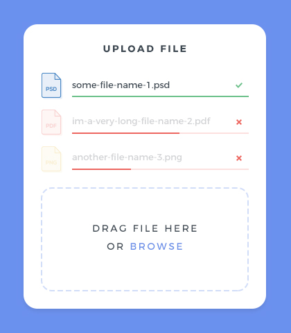

# vue-file-drop-component

[](https://app.netlify.com/sites/vue-file-drop-component/deploys)



## DEMO
https://vue-file-drop-component.netlify.app/


## Project setup
```
yarn install
```

### Compiles and hot-reloads for development
```
yarn serve
```

### Compiles and minifies for production
```
yarn build
```

### Run your unit tests
```
yarn test:unit
```

### Lints and fixes files
```
yarn lint
```

